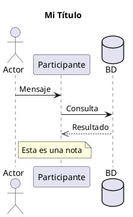

# 📊 Diagramas UML - Sistema de Ventas y Forma de Pago

Este directorio contiene **3 diagramas UML profesionales** en formato **PlantUML** que pueden ser importados y editados en **StarUML** o visualizados directamente.

## 📁 Archivos Incluidos

### 1. **DiagramaVentasPago.puml**
- **Tipo:** Diagrama de Secuencia (Sequence Diagram)
- **Descripción:** Muestra el flujo completo del proceso de pago desde que el usuario accede hasta que recibe la confirmación
- **Incluye:** 7 fases de interacción:
  1. Acceso a página de pago
  2. Confirmación de pago
  3. Validaciones iniciales
  4. Transacción - crear venta
  5. Procesar productos del carrito
  6. Confirmar transacción
  7. Limpieza y redirección

### 2. **DiagramaEstructura.puml**
- **Tipo:** Diagrama de Entidad-Relación (ER Diagram / Class Diagram)
- **Descripción:** Muestra la estructura de la base de datos con todas las tablas y sus relaciones
- **Entidades principales:**
  - Cuenta (credenciales)
  - Cliente (datos personales)
  - NotaVenta (facturas)
  - DetalleNotaVenta (líneas de compra)
  - Producto (artículos)
  - DetalleProductoSucursal (stock)
  - Sucursal, Marca, Industria, Categoría

### 3. **DiagramaActividades.puml**
- **Tipo:** Diagrama de Actividades (Activity Diagram)
- **Descripción:** Flujo de actividades con decisiones y puntos de validación
- **Incluye:** Todos los puntos de error y validaciones en el proceso

---

## 🛠️ Cómo Usar Estos Archivos

### Opción 1: Visualizar en VS Code (Recomendado - Más fácil)

1. **Extensión instalada:** Ya tienes la extensión **PlantUML** instalada
2. **Ver diagrama:** Click derecho en el archivo `.puml` → `Preview PlantUML`
3. **Exportar:** Click derecho → `PlantUML: Export current diagram` → Seleccionar formato (PNG, SVG, PDF)

### Opción 2: Usar en StarUML (Profesional)

1. **Descargar StarUML:** https://staruml.io/
2. **Convertir el archivo:**
   - Opción A: Copiar el contenido del archivo `.puml`
   - Opción B: Importar directamente si StarUML soporta PlantUML
3. **En StarUML:**
   - Archivo → New → Seleccionar tipo de diagrama
   - Recrear manualmente basándose en la estructura del `.puml`
   - O usar una herramienta online de conversión

### Opción 3: Herramientas Online (Sin instalar nada)

1. **PlantUML Online:** https://www.plantuml.com/plantuml/uml/
2. **Paste el contenido del archivo `.puml`**
3. **Ver previsualización en tiempo real**
4. **Exportar como PNG, SVG, PDF**

### Opción 4: Compilar Localmente (Para profesionales)

```bash
# Instalar PlantUML
# Windows: usar Chocolatey o descargar manualmente

# Compilar a PNG
plantuml DiagramaVentasPago.puml -o output.png

# Compilar a SVG (mejor calidad)
plantuml DiagramaVentasPago.puml -tsvg -o output.svg

# Compilar a PDF
plantuml DiagramaVentasPago.puml -tpdf -o output.pdf
```

---

## 📋 Contenido Detallado de Cada Diagrama

### DiagramaVentasPago.puml - Secuencia de Pago

**Participantes:**
- 👤 Usuario/Cliente
- 📄 Vista Pago (pago.php)
- 🎮 PagoControlador (index.php)
- 💼 VentaModelo (Venta.php)
- 🗄️ Base de Datos

**Fases principales:**
1. Usuario accede a /pago
2. Controlador valida carrito
3. Usuario revisa y confirma compra
4. Validación de usuario logueado
5. Obtener CI del cliente
6. BEGIN TRANSACTION
7. Crear NotaVenta
8. Loop para cada producto
9. Insertar DetalleNotaVenta
10. Descontar stock
11. COMMIT TRANSACTION
12. Limpiar carrito
13. Redirigir a confirmación
14. Mostrar éxito

### DiagramaEstructura.puml - Tablas y Relaciones

**Relaciones principales:**
- Cliente → Cuenta (N:1) - Acceso del cliente
- Cliente → NotaVenta (1:N) - Cliente realiza compras
- NotaVenta → DetalleNotaVenta (1:N) - Compra contiene líneas
- DetalleNotaVenta → Producto (N:1) - Línea referencia producto
- Producto → DetalleProductoSucursal (1:N) - Stock por sucursal
- Producto → Marca, Industria, Categoría (N:1) - Clasificación

### DiagramaActividades.puml - Flujo de Decisiones

**Puntos de decisión:**
1. ¿Carrito vacío?
2. ¿Usuario logueado?
3. ¿Existe cliente?
4. ¿Existe producto? (para cada producto)
5. ¿Stock suficiente? (para cada producto)
6. ¿Mínimo 1 producto válido?

---

## 🎨 Características de Formato StarUML

Estos archivos están diseñados para verse exactamente como los diagramas de StarUML:

✅ **Colores profesionales:**
- Actores: Azul claro (#E3F2FD)
- Participantes: Púrpura (#667eea)
- Decisiones: Naranja (#FFF3E0)
- Notas: Amarillo (#FFFFCC)

✅ **Elementos incluidos:**
- Títulos descriptivos
- Numeración de mensajes
- Notas explicativas
- Fragmentos de interacción (alt, loop, etc.)
- Líneas de vida
- Activaciones y desactivaciones

✅ **Documentación interna:**
- Cada sección está claramente marcada
- Notas al lado de decisiones críticas
- Explicación de valores de retorno

---

## 📝 Cómo Editar los Diagramas

Si necesitas modificar los diagramas:

1. **Abrir archivo `.puml` en VS Code**
2. **Editar el contenido PlantUML**
3. **Previsualizar con la extensión**
4. **Exportar a imagen cuando esté listo**

### Sintaxis rápida PlantUML:



---

## 🔄 Exportar Diagramas

Desde la extensión PlantUML en VS Code:

1. Click derecho en archivo `.puml`
2. `PlantUML: Export current diagram`
3. Seleccionar formato:
   - **PNG** - Para documentos, presentaciones
   - **SVG** - Para web, mejor calidad
   - **PDF** - Para imprimir
   - **TXT** - Para integrar en documentación

---

## 📚 Referencias

- **PlantUML Documentation:** https://plantuml.com/
- **StarUML:** https://staruml.io/
- **UML 2.5 Specification:** https://www.uml.org/

---

## 💡 Próximas Acciones

1. ✅ Ver los diagramas en VS Code (Preview PlantUML)
2. ✅ Exportar como PNG/SVG si necesitas incluirlos en documentación
3. ✅ Si necesitas editar en StarUML, importar/recrear basándose en estos archivos
4. ✅ Mantener estos archivos `.puml` como documentación en el control de versiones (Git)

---

**Generado:** 19 de Abril de 2026  
**Sistema:** Tienda Online - Ventas y Pago  
**Formato:** PlantUML (Compatible con StarUML, LucidChart, Draw.io, etc.)
